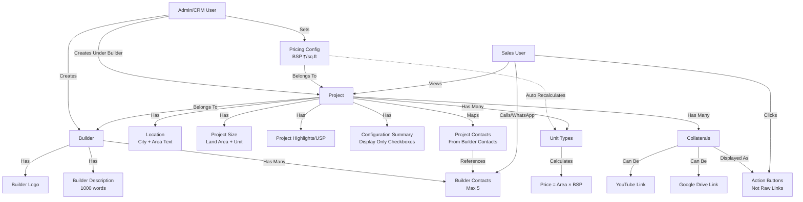

# Builder, Project, Collateral & Pricing System - Complete Implementation Plan

## Overview

This plan implements a comprehensive real estate project management system following the flow: **Builder → Project → Unit Types → Collaterals**. The system features builder management with logo and description, project management with location and size details, BSP-based auto-calculated pricing, and button-based collateral access (YouTube + Google Drive). Primary actions are Call/WhatsApp integration.

## System Flow Diagram



## Module Flow Diagram

```mermaid
flowchart TD
    Start[Start] --> BuilderModule[Module 1: Builder Create]
    BuilderModule --> BuilderFields[Builder Fields:<br/>Name, Logo, Description, Status]
    BuilderFields --> BuilderContacts[Builder Contacts:<br/>Max 5, Inline Repeater]
    BuilderContacts --> ProjectModule[Module 2: Project Create]
    
    ProjectModule --> ProjectBasic[Project Basic Fields:<br/>Builder, Name, Type, Status]
    ProjectBasic --> ProjectLocation[Location:<br/>City + Area Text Fields]
    ProjectLocation --> ProjectSize[Project Size:<br/>Land Area + Unit]
    ProjectSize --> ProjectInfo[Optional Info:<br/>RERA, Possession, Highlights]
    ProjectInfo --> ConfigSummary[Configuration Summary:<br/>Checkboxes Display Only]
    ConfigSummary --> ProjectContacts[Project Contacts:<br/>Primary, Secondary, Escalation]
    
    ProjectContacts --> PricingModule[Module 3: Pricing BSP]
    PricingModule --> SetBSP[Set BSP ₹/sq.ft]
    SetBSP --> RoundingRule[Price Rounding Rule]
    
    RoundingRule --> UnitTypesModule[Module 4: Unit Types]
    UnitTypesModule --> AddUnitType[Add Unit Type Row:<br/>BHK + Area]
    AddUnitType --> AutoCalculate[Auto Calculate Price]
    AutoCalculate --> MarkStarting[Mark Cheapest as<br/>Starting From]
    
    MarkStarting --> CollateralsModule[Module 5: Collaterals]
    CollateralsModule --> AddCollateral[Add Collateral:<br/>Category + Link]
    AddCollateral --> ValidateLink[Validate YouTube/Drive]
    ValidateLink --> DisplayButtons[Display as Action Buttons]
    
    DisplayButtons --> SalesView[Sales View: Project Detail]
    SalesView --> StickyBar[Sticky Action Bar:<br/>Call/WhatsApp]
    StickyBar --> Tabs[Tabs: Overview,<br/>Pricing, Collaterals]
    Tabs --> End[End]
```



## Database Schema

### 1. Builders Table (`builders`)

- `id` (primary key)
- `name` (required, unique)
- `logo` (string, nullable) - Path to uploaded logo image
- `description` (text, nullable) - Up to 1000 words
- `status` (enum: active/inactive, default: active)
- `timestamps`, `soft_deletes`

**File Storage**: Logo stored in `storage/app/public/builders/logos/`

### 2. Builder Contacts Table (`builder_contacts`)

- `id` (primary key)
- `builder_id` (foreign key, required)
- `person_name` (required)
- `mobile_number` (required, 10-15 digits)
- `whatsapp_number` (nullable)
- `whatsapp_same_as_mobile` (boolean, default: false)
- `preferred_mode` (enum: call/whatsapp/both, default: both)
- `is_active` (boolean, default: true)
- `timestamps`, `soft_deletes`
- **Constraints**: Max 5 active contacts per builder

### 3. Projects Table (`projects` - replace existing)

- `id` (primary key)
- `builder_id` (foreign key, required)
- `name` (required)
- `project_type` (enum: residential/commercial/mixed)
- `project_status` (enum: prelaunch/under_construction/ready)
- `availability_type` (enum: fresh/resale/both, default: fresh)
- `city` (string, required) - Text field, not dropdown
- `area` (string, required) - Area/Locality text field
- `land_area` (decimal 10,2, nullable) - Project size
- `land_area_unit` (enum: acres/sq_ft, default: sq_ft)
- `rera_no` (string, nullable)
- `possession_date` (date, nullable)
- `project_highlights` (text, nullable) - USP/Highlights textarea
- `configuration_summary` (json, nullable) - Store checked BHK types: `["studio", "1bhk", "2bhk", "3bhk", "4bhk", "other"]`
- `is_active` (boolean, default: true)
- `timestamps`, `soft_deletes`

**Note**: Configuration Summary is display-only checkboxes, stored as JSON array for reference.

### 4. Project Contacts Table (`project_contacts` - pivot)

- `id` (primary key)
- `project_id` (foreign key)
- `builder_contact_id` (foreign key)
- `contact_role` (enum: primary/secondary/escalation)
- `timestamps`
- **Constraints**: One primary per project, unique role per project

### 5. Project Collaterals Table (`project_collaterals`)

- `id` (primary key)
- `project_id` (foreign key)
- `category` (enum: brochure/floor_plans/layout_plan/price_sheet/videos/legal_approvals/other)
- `title` (required)
- `link` (required, URL) - Can be YouTube or Google Drive
- `link_type` (enum: youtube/google_drive, nullable) - Auto-detected
- `is_latest` (boolean, default: false) - Only for price_sheet category
- `notes` (text, nullable)
- `timestamps`, `soft_deletes`

**Link Validation**:

- YouTube: Must contain `youtube.com` or `youtu.be`
- Google Drive: Must contain `drive.google.com`

### 6. Pricing Config Table (`pricing_configs`)

- `id` (primary key)
- `project_id` (foreign key, unique)
- `bsp_per_sqft` (decimal 15,2, required)
- `price_rounding_rule` (enum: none/nearest_1000/nearest_10000, default: none)
- `timestamps`

### 7. Unit Types Table (`unit_types`)

- `id` (primary key)
- `project_id` (foreign key)
- `unit_type` (string, required) - e.g., "1BHK", "2BHK", "Studio", "Penthouse", "Shop", "Office" or custom
- `area_sqft` (decimal 10,2, required, > 0)
- `calculated_price` (decimal 15,2, nullable) - Auto-calculated
- `display_label` (string, nullable) - Auto-generated: "2BHK (850 sq.ft)"
- `is_starting_from` (boolean, default: false) - Auto-marked cheapest unit
- `timestamps`, `soft_deletes`

**Price Display Format**: "₹63.75 L" (Lakhs) or "₹7.50 Cr" (Crores)

## Implementation Steps

### Phase 1: Database & Models

1. **Create Migration for Builders**

   - File: `database/migrations/YYYY_MM_DD_HHMMSS_create_builders_table.php`
   - Fields: name (unique), logo (nullable string), description (text, nullable), status, timestamps, soft_deletes

2. **Create Migration for Builder Contacts**

   - File: `database/migrations/YYYY_MM_DD_HHMMSS_create_builder_contacts_table.php`
   - Foreign key to builders, all contact fields, validation for max 5 contacts

3. **Modify Projects Migration**

   - File: `database/migrations/YYYY_MM_DD_HHMMSS_modify_projects_table_for_builders.php`
   - Remove old fields, add: builder_id, project_type, project_status, city (text), area (text), land_area, land_area_unit, rera_no, possession_date, project_highlights, configuration_summary (json), availability_type
   - Keep: name, is_active, timestamps, soft_deletes

4. **Create Migration for Project Contacts**

   - File: `database/migrations/YYYY_MM_DD_HHMMSS_create_project_contacts_table.php`
   - Pivot table with project_id, builder_contact_id, contact_role

5. **Create Migration for Project Collaterals**

   - File: `database/migrations/YYYY_MM_DD_HHMMSS_create_project_collaterals_table.php`
   - All collateral fields with category enum, link (URL), link_type (enum: youtube/google_drive)

6. **Create Migration for Pricing Config**

   - File: `database/migrations/YYYY_MM_DD_HHMMSS_create_pricing_configs_table.php`
   - One-to-one with projects, BSP and rounding fields

7. **Create Migration for Unit Types**

   - File: `database/migrations/YYYY_MM_DD_HHMMSS_create_unit_types_table.php`
   - All unit type fields, remove area_type and price_override (simplified)

8. **Create Models**

   - `app/Models/Builder.php` - Relationships, logo accessor, description methods
   - `app/Models/BuilderContact.php` - Belongs to builder
   - Modify `app/Models/Project.php` - Replace existing, add builder relationship, configuration_summary accessor
   - `app/Models/ProjectContact.php` - Pivot model
   - `app/Models/ProjectCollateral.php` - Belongs to project, link type detection, button generation methods
   - `app/Models/PricingConfig.php` - Belongs to project (one-to-one)
   - `app/Models/UnitType.php` - Belongs to project, pricing calculation, display label generation

### Phase 2: Business Logic & Services

9. **Builder Service**

   - File: `app/Services/BuilderService.php`
   - Methods: createBuilder, updateBuilder, uploadLogo, deleteLogo, addContact, updateContact, validateMaxContacts, getActiveContacts

10. **Project Service**

    - File: `app/Services/ProjectService.php`
    - Methods: createProject, updateProject, assignContacts, validatePrimaryContact, getContactsByRole, updateConfigurationSummary

11. **Pricing Service**

    - File: `app/Services/PricingService.php`
    - Methods: setBSP, calculateUnitPrice, recalculateAllPrices, applyRoundingRule, formatPrice, markStartingFrom

12. **Collateral Service**

    - File: `app/Services/CollateralService.php`
    - Methods: addCollateral, updateCollateral, detectLinkType, validateLink, markLatestPriceSheet, getByCategory, generateButtonData

13. **Model Observers/Events**

    - `app/Observers/PricingConfigObserver.php` - Listen to BSP updates, trigger recalculation
    - `app/Observers/UnitTypeObserver.php` - Auto-update display_label, mark starting_from on create/update
    - Event: `PricingConfigUpdated` → Recalculate all unit types for that project

### Phase 3: API Controllers

14. **Builder API Controller**

    - File: `app/Http/Controllers/Api/BuilderController.php`
    - Routes: `GET /api/builders`, `POST /api/builders` (with logo upload), `GET /api/builders/{id}`, `PUT /api/builders/{id}`, `DELETE /api/builders/{id}`
    - Logo upload: `POST /api/builders/{id}/logo`
    - Nested: `POST /api/builders/{id}/contacts`, `PUT /api/builders/{id}/contacts/{contactId}`, `DELETE /api/builders/{id}/contacts/{contactId}`
    - Middleware: `role:admin,crm` for CUD, `auth:sanctum` for read

15. **Project API Controller**

    - File: `app/Http/Controllers/Api/ProjectController.php`
    - Routes: `GET /api/builders/{builderId}/projects`, `POST /api/builders/{builderId}/projects`, `GET /api/projects/{id}`, `PUT /api/projects/{id}`, `DELETE /api/projects/{id}`
    - Nested contacts: `POST /api/projects/{id}/contacts`, `PUT /api/projects/{id}/contacts/{contactId}`, `DELETE /api/projects/{id}/contacts/{contactId}`
    - Middleware: `role:admin,crm` for CUD, `auth:sanctum` for read

16. **Collateral API Controller**

    - File: `app/Http/Controllers/Api/ProjectCollateralController.php`
    - Routes: `GET /api/projects/{projectId}/collaterals`, `POST /api/projects/{projectId}/collaterals`, `PUT /api/collaterals/{id}`, `DELETE /api/collaterals/{id}`
    - Additional: `GET /api/projects/{projectId}/collaterals/buttons` - Returns formatted button data
    - Middleware: `role:admin,crm` for CUD, `auth:sanctum` for read

17. **Pricing API Controller**

    - File: `app/Http/Controllers/Api/PricingController.php`
    - Routes: `GET /api/projects/{projectId}/pricing`, `PUT /api/projects/{projectId}/pricing`
    - Middleware: `role:admin,crm`

18. **Unit Type API Controller**

    - File: `app/Http/Controllers/Api/UnitTypeController.php`
    - Routes: `GET /api/projects/{projectId}/unit-types`, `POST /api/projects/{projectId}/unit-types`, `PUT /api/unit-types/{id}`, `DELETE /api/unit-types/{id}`
    - Middleware: `role:admin,crm` for CUD, `auth:sanctum` for read

19. **Project Detail API Controller**

    - File: `app/Http/Controllers/Api/ProjectDetailController.php`
    - Routes: `GET /api/projects/{id}/detail` - Returns project with contacts, collaterals (as buttons), pricing, unit types
    - Helper methods: formatPhoneForWhatsApp, getWhatsAppUrl, getCallUrl

### Phase 4: Web Controllers & Blade Views

20. **Builder Web Controller**

    - File: `app/Http/Controllers/BuilderController.php` (web routes, not API)
    - Methods: index, create, store (with logo upload), edit, update, destroy
    - Inline contact management in create/edit forms
    - Logo upload handling

21. **Project Web Controller** (replace existing ProjectController)

    - File: `app/Http/Controllers/ProjectController.php`
    - Methods: index (filterable by builder), create, store, edit, update, destroy, show (detail page)
    - Single long form (no wizard) with all sections
    - Contact assignment in create/edit forms
    - Configuration summary handling (display only)

22. **Blade Views**

    - `resources/views/builders/index.blade.php` - List all builders with logos
    - `resources/views/builders/form.blade.php` - Create/Edit builder with:
      - Logo upload with preview
      - Description textarea (1000 words max indicator)
      - Inline contacts (repeater UI, max 5)
    - `resources/views/projects/index.blade.php` - List projects (filterable by builder)
    - `resources/views/projects/form.blade.php` - Single long form with sections:
      - Basic Info (Builder, Name, Type, Status, Availability)
      - Location (City, Area text fields)
      - Project Size (Land Area + Unit)
      - Optional Info (RERA, Possession, Highlights)
      - Configuration Summary (Checkboxes - Display Only)
      - Project Contacts (Primary, Secondary, Escalation dropdowns)
    - `resources/views/projects/show.blade.php` - Project detail page with:
      - **Sticky Action Bar** (top): Call Builder, WhatsApp Builder (with dropdown for Secondary/Escalation)
      - **Tabs**: Overview, Unit Types & Pricing, Collaterals
      - Overview tab: Project summary, location, size, highlights
      - Pricing tab: BSP input (highlighted), unit types table with prices
      - Collaterals tab: **Button-based display** (not links)
        - Category buttons: [📄 Brochure] [📐 Floor Plans] [🗺 Layout] [🎥 Videos] [💰 Price Sheet] [📁 Legal Docs]
        - Multiple items in category: Dropdown or modal list
        - "Latest" price sheet: Highlighted button

23. **JavaScript for UI**

    - Logo upload preview
    - Repeater UI for builder contacts (add/remove rows, max 5)
    - Configuration summary checkboxes (display only, no form submission)
    - Contact assignment dropdowns in project form
    - Collateral button generation and click handlers
    - WhatsApp/Call button logic (mobile vs desktop)
    - Price recalculation on BSP change (frontend preview)
    - Sticky action bar behavior
    - Mobile-first responsive design

### Phase 5: Validation & Form Requests

24. **Form Request Classes**

    - `app/Http/Requests/StoreBuilderRequest.php` - Validate name, logo (image, max 2MB), description (max 1000 words)
    - `app/Http/Requests/UpdateBuilderRequest.php`
    - `app/Http/Requests/StoreBuilderContactRequest.php`
    - `app/Http/Requests/StoreProjectRequest.php` - Validate all project fields, configuration_summary (array)
    - `app/Http/Requests/UpdateProjectRequest.php`
    - `app/Http/Requests/StoreProjectCollateralRequest.php` - Validate link (YouTube or Drive URL)
    - `app/Http/Requests/UpdatePricingConfigRequest.php`
    - `app/Http/Requests/StoreUnitTypeRequest.php`

### Phase 6: Routes

25. **API Routes** (`routes/api.php`)

    - Builder routes (with logo upload, contacts nested)
    - Project routes (with collaterals, pricing, unit-types nested)
    - Project detail route

26. **Web Routes** (`routes/web.php`)

    - Replace existing project routes
    - Add builder routes
    - Middleware: `auth`, `role:admin,crm` for management

### Phase 7: Helpers & Utilities

27. **Helper Functions**

    - `app/Helpers/ContactHelper.php` - formatPhoneForWhatsApp, getWhatsAppUrl, getCallUrl, isMobileDevice
    - `app/Helpers/PricingHelper.php` - formatIndianCurrency (₹63.75 L), applyRoundingRule, convertToLakhsCrores
    - `app/Helpers/CollateralHelper.php` - detectLinkType, validateYouTubeLink, validateDriveLink, generateButtonHtml, getCategoryIcon

### Phase 8: Permissions & Middleware

28. **Update Permissions**

    - Add new permissions to `CheckPermission` middleware if needed
    - Admin/CRM: Full access (CUD)
    - Sales: Read-only access, can open collaterals, can call/WhatsApp

## Key Implementation Details

### Builder Module

- **Logo Upload**: 
  - Accept: JPG, PNG, WebP
  - Max size: 2MB
  - Storage: `storage/app/public/builders/logos/`
  - Display: Thumbnail in list, full size in detail
- **Description**: 
  - Textarea, max 1000 words
  - Character counter
  - Rich text optional (future enhancement)
- **Contacts**: 
  - Inline repeater UI in builder form
  - Max 5 contacts
  - Min 1 contact required
  - Contacts reused across all builder's projects

### Project Module

- **Location**: 
  - City and Area as **text fields** (not dropdown)
  - Free-form input
- **Project Size**: 
  - Land Area (numeric)
  - Unit: Acres or Sq.ft (dropdown)
- **Project Highlights**: 
  - Textarea for USP/Highlights
  - No word limit
- **Configuration Summary**: 
  - Checkboxes: Studio, 1BHK, 2BHK, 3BHK, 4BHK, Other
  - **Display only** - not used for filtering, just for reference
  - Stored as JSON array
  - Not required field

### Pricing Calculation Logic

- Formula: `price = area_sqft × bsp_per_sqft`
- Rounding: Apply rounding rule if set (nearest 1000/10000)
- Auto-recalculation: When BSP changes, recalculate all unit types
- Display Format: 
  - Indian currency: ₹63.75 L (Lakhs) or ₹7.50 Cr (Crores)
  - Conversion: 1 Lakh = 100,000, 1 Crore = 10,000,000
- Starting From: Cheapest unit auto-marked with `is_starting_from = true`

### Unit Type Labels

- Auto-generate: If same unit_type exists multiple times, create labels like "2BHK (850 sq.ft)"
- Store in `display_label` field
- Formula: `"{unit_type} ({area_sqft} sq.ft)"`
- Display in table with price: "2BHK (850 sq.ft) → ₹63.75 L"

### Collateral Display (Button-Based UX) ⭐

**IMPORTANT**: Do NOT show raw links. Always show action buttons.

**Button Categories**:

- 📄 Brochure
- 📐 Floor Plans
- 🗺 Layout Plan
- 🎥 Videos
- 💰 Price Sheet
- 📁 Legal / RERA
- 📋 Other

**Button Behavior**:

- Single item in category: Direct button click → opens link in new tab
- Multiple items in category: 
  - Option 1: Dropdown button → shows list, click item opens link
  - Option 2: Button with count badge → click opens modal with list
- "Latest" price sheet: Highlighted button (primary color, "Latest" badge)
- Button styling: Mobile-friendly, touch targets ≥44px

**Link Types Supported**:

- YouTube: `youtube.com/watch?v=...` or `youtu.be/...`
- Google Drive: `drive.google.com/file/d/...` or `drive.google.com/folder/d/...`

**Implementation**:

- Backend: `CollateralHelper::generateButtonHtml()` returns button HTML
- Frontend: JavaScript handles button clicks, opens links in new tab
- Group by category, show count if multiple

### Call/WhatsApp Integration

- **Call Logic:**
  - Mobile: Use `tel:` protocol → `tel:+919876543210`
  - Desktop: Show modal with number + Copy button
- **WhatsApp Logic:**
  - Mobile: `https://wa.me/919876543210` (country code, no +)
  - Desktop: `https://web.whatsapp.com/send?phone=919876543210`
  - No message prefill (open only)
  - Fallback: Use mobile number if WhatsApp number is empty
- **Sticky Action Bar:**
  - Always visible at top of project detail page
  - Default: Primary contact
  - Dropdown: Secondary, Escalation contacts
  - Mobile: Full-width buttons
  - Desktop: Right-aligned buttons

### Project Detail Page Structure

**Sticky Action Bar** (Top):

```
[📞 Call Builder] [💬 WhatsApp Builder] [▼ More Contacts]
```

**Tabs**:

1. **Overview**

   - Project summary card
   - Location (City, Area)
   - Project Size (Land Area + Unit)
   - Status, Type, Availability
   - Project Highlights/USP
   - Configuration Summary (checked BHK types)

2. **Unit Types & Pricing**

   - BSP Section (highlighted box):
     - BSP: ₹X,XXX / sq.ft
     - Rounding Rule: [Dropdown]
   - Unit Types Table:
     - Columns: Unit Type, Area, Price, Starting From
     - Auto-calculated prices
     - Cheapest marked as "Starting From"

3. **Collaterals**

   - Button Grid Layout:
     ```
     [📄 Brochure (2)]  [📐 Floor Plans (1)]
     [🗺 Layout]        [🎥 Videos (3)]
     [💰 Price Sheet Latest] [📁 Legal Docs]
     ```

   - Click button → opens link(s) in new tab
   - Multiple items: Show count badge, dropdown/modal on click

### UX Rules

- **No Multi-Step Wizard**: Single long form with collapsible sections
- **BSP Always Visible**: Highlighted box, top of pricing section
- **Collaterals Always Buttons**: Never show raw links
- **Call/WhatsApp Always Visible**: Sticky action bar
- **Mobile-First**: Responsive design, touch-friendly buttons
- **Configuration Summary**: Display only, not used in logic

## Files to Create/Modify

### New Files

- 7 migration files
- 7 new models
- 5 API controllers
- 2 web controllers (or modify existing)
- 8 form request classes
- 4 service classes
- 2 observers
- 1 event class
- ~8 Blade view files
- 3 helper files

### Files to Modify

- `app/Models/Project.php` - Complete replacement
- `app/Http/Controllers/ProjectController.php` - Complete replacement
- `routes/api.php` - Add new routes
- `routes/web.php` - Update project routes, add builder routes
- `app/Http/Middleware/CheckPermission.php` - Add new permissions if needed
- Delete or archive old project views if not needed

## Testing Considerations

- Unit tests for pricing calculations (including lakhs/crores conversion)
- Unit tests for contact validation (max 5)
- Unit tests for link type detection (YouTube vs Drive)
- Integration tests for BSP update triggering recalculation
- Integration tests for "starting from" auto-marking
- API endpoint tests
- Form validation tests (logo upload, description word count)
- Button generation tests
- Call/WhatsApp URL generation tests

## Future Enhancements (Out of Scope)

- Rich text editor for builder description
- Image gallery for projects
- Unit availability tracking
- Price history/audit log
- Multiple price sheets with versioning
- Export pricing to Excel/PDF
- Advanced filtering by configuration summary
- Project comparison feature