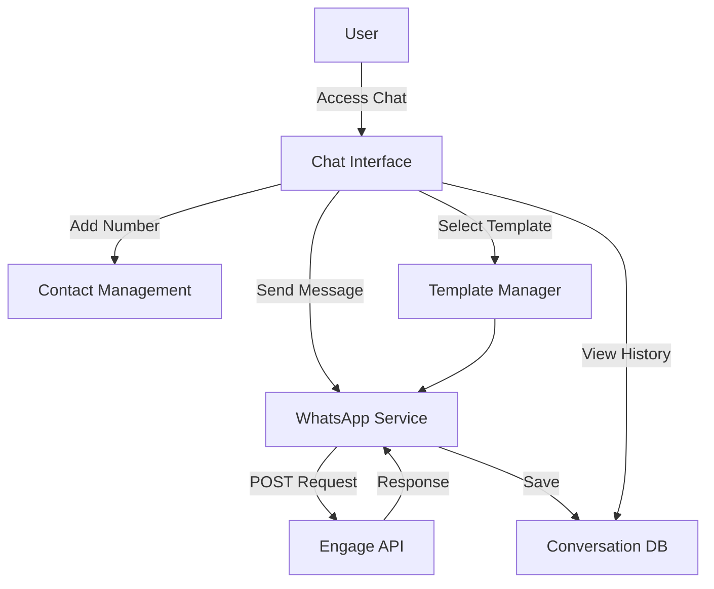

# WhatsApp Chat Integration Plan

## Overview

Implement a complete WhatsApp chat system using the Engage API (`https://engage-api-eta.vercel.app/`) with three main features:

1. **Template Messages** - Send pre-approved WhatsApp templates
2. **Normal Chats** - Send regular text messages
3. **Conversation History** - View and manage chat conversations

## Architecture



## Database Schema

### 1. WhatsApp Conversations Table

**File:** `database/migrations/YYYY_MM_DD_HHMMSS_create_whatsapp_conversations_table.php`

```php
Schema::create('whatsapp_conversations', function (Blueprint $table) {
    $table->id();
    $table->foreignId('user_id')->constrained()->onDelete('cascade');
    $table->string('phone_number'); // Recipient phone number
    $table->string('contact_name')->nullable(); // Optional name for contact
    $table->timestamps();
    $table->softDeletes();
    
    $table->index(['user_id', 'phone_number']);
});
```

### 2. WhatsApp Messages Table

**File:** `database/migrations/YYYY_MM_DD_HHMMSS_create_whatsapp_messages_table.php`

```php
Schema::create('whatsapp_messages', function (Blueprint $table) {
    $table->id();
    $table->foreignId('conversation_id')->constrained('whatsapp_conversations')->onDelete('cascade');
    $table->foreignId('user_id')->constrained()->onDelete('cascade');
    $table->enum('direction', ['sent', 'received']);
    $table->text('message');
    $table->string('message_id')->nullable(); // API message ID
    $table->string('template_id')->nullable(); // If sent via template
    $table->enum('status', ['pending', 'sent', 'delivered', 'read', 'failed'])->default('pending');
    $table->text('error_message')->nullable();
    $table->json('api_response')->nullable(); // Store full API response
    $table->timestamp('sent_at')->nullable();
    $table->timestamps();
    
    $table->index(['conversation_id', 'created_at']);
    $table->index(['user_id', 'created_at']);
});
```

### 3. WhatsApp Templates Table (Optional - for storing template info)

**File:** `database/migrations/YYYY_MM_DD_HHMMSS_create_whatsapp_templates_table.php`

```php
Schema::create('whatsapp_templates', function (Blueprint $table) {
    $table->id();
    $table->string('template_id'); // API template ID
    $table->string('name');
    $table->text('content');
    $table->string('category')->nullable();
    $table->string('language')->default('en');
    $table->boolean('is_active')->default(true);
    $table->timestamps();
});
```

## Models

### 1. WhatsAppConversation Model

**File:** `app/Models/WhatsAppConversation.php`

- Relationships: `user()`, `messages()`
- Methods: `getLatestMessage()`, `getUnreadCount()`, `markAsRead()`

### 2. WhatsAppMessage Model

**File:** `app/Models/WhatsAppMessage.php`

- Relationships: `conversation()`, `user()`
- Methods: `markAsDelivered()`, `markAsRead()`, `markAsFailed()`

### 3. WhatsAppTemplate Model (Optional)

**File:** `app/Models/WhatsAppTemplate.php`

- Methods: `syncFromAPI()`, `getAvailableTemplates()`

## Service Layer Updates

### Update WhatsAppApiService

**File:** `app/Services/WhatsAppApiService.php`

Add methods:

1. `sendTemplateMessage(string $to, string $templateId, array $parameters = [])` - Send template message
2. `sendTextMessage(string $to, string $message)` - Send normal text message
3. `getConversations(string $phone = null)` - Get conversation history
4. `getTemplates()` - Fetch available templates from API
5. `getMessageStatus(string $messageId)` - Check message delivery status

**API Endpoint Discovery:**

- First, try to fetch API documentation from root endpoint
- Test common endpoint patterns:
  - `/api/send-message` (POST)
  - `/api/send-template` (POST)
  - `/api/conversations` (GET)
  - `/api/templates` (GET)
  - `/api/messages/{id}/status` (GET)

## Controllers

### 1. WhatsAppChatController

**File:** `app/Http/Controllers/WhatsAppChatController.php`

**Routes:**

- `GET /chat` - Chat interface (index)
- `GET /chat/conversations` - List all conversations (AJAX)
- `POST /chat/conversations` - Create new conversation (add number)
- `GET /chat/conversations/{id}` - Get conversation with messages
- `POST /chat/messages` - Send message
- `POST /chat/messages/template` - Send template message
- `GET /chat/templates` - Get available templates
- `PUT /chat/conversations/{id}/read` - Mark conversation as read
- `DELETE /chat/conversations/{id}` - Delete conversation

## Views

### 1. Chat Interface

**File:** `resources/views/chat/index.blade.php`

**Features:**

- Left sidebar: List of conversations (phone numbers)
- Right panel: Active conversation with messages
- Top bar: Search, add new contact button
- Message input: Text area + template selector + send button
- Real-time updates via AJAX polling or WebSocket

**UI Components:**

- Conversation list item (phone, last message, timestamp, unread badge)
- Message bubble (sent/received, timestamp, status indicator)
- Template selector modal
- Add contact modal

### 2. Chat Layout (if needed)

**File:** `resources/views/chat/layout.blade.php`

## Routes

**File:** `routes/web.php`

```php
Route::middleware(['auth'])->prefix('chat')->name('chat.')->group(function () {
    Route::get('/', [WhatsAppChatController::class, 'index'])->name('index');
    Route::get('/conversations', [WhatsAppChatController::class, 'getConversations'])->name('conversations.index');
    Route::post('/conversations', [WhatsAppChatController::class, 'createConversation'])->name('conversations.create');
    Route::get('/conversations/{id}', [WhatsAppChatController::class, 'getConversation'])->name('conversations.show');
    Route::post('/messages', [WhatsAppChatController::class, 'sendMessage'])->name('messages.send');
    Route::post('/messages/template', [WhatsAppChatController::class, 'sendTemplateMessage'])->name('messages.template');
    Route::get('/templates', [WhatsAppChatController::class, 'getTemplates'])->name('templates.index');
    Route::put('/conversations/{id}/read', [WhatsAppChatController::class, 'markAsRead'])->name('conversations.read');
    Route::delete('/conversations/{id}', [WhatsAppChatController::class, 'deleteConversation'])->name('conversations.delete');
});
```

## Navigation Integration

### Update Sidebar Navigation

**File:** `resources/views/layouts/app.blade.php`

Add chat link in navigation (for all authenticated users):

```php
<a href="{{ route('chat.index') }}" class="sidebar-link {{ request()->routeIs('chat.*') ? 'active' : '' }}">
    <i class="fab fa-whatsapp" style="margin-right: 10px; width: 20px;"></i>
    WhatsApp Chat
</a>
```

Place it after "Calls" section and before "Reports" section.

## Features Implementation

### 1. Template Messages

- Fetch templates from API (or store locally)
- Display template selector in chat interface
- Allow parameter substitution (if templates support variables)
- Send via `sendTemplateMessage()` method

### 2. Normal Chats

- Text input field in chat interface
- Send button triggers `sendMessage()` method
- Real-time message display
- Status indicators (sent, delivered, read)

### 3. Conversation History

- Display all conversations for logged-in user
- Show last message preview
- Unread message count badge
- Search/filter conversations
- Pagination for large conversation lists

## Security & Validation

1. **User Isolation**: Each user can only see their own conversations
2. **Phone Validation**: Validate phone number format before sending
3. **Rate Limiting**: Implement rate limiting for API calls
4. **Error Handling**: Proper error messages for failed sends
5. **Input Sanitization**: Sanitize all user inputs

## API Integration Details

### Endpoint Discovery Strategy

1. Check API Explorer page for documentation
2. Test common REST patterns
3. Log successful endpoints for future use
4. Fallback to manual configuration if auto-detection fails

### Request Format (Expected)

```json
POST /api/send-message
{
    "to": "918354006519",
    "message": "Hello, this is a test message"
}

POST /api/send-template
{
    "to": "918354006519",
    "template_id": "template_123",
    "parameters": {}
}

GET /api/conversations?phone=918354006519
GET /api/templates
```

## Testing Strategy

1. **Unit Tests**: Service methods, model relationships
2. **Feature Tests**: Controller endpoints, authentication
3. **Integration Tests**: API communication, error handling
4. **Manual Testing**: UI/UX, real message sending

## Implementation Order

1. Database migrations and models
2. Service layer updates (API integration)
3. Controllers and routes
4. Chat interface UI
5. Navigation integration
6. Template management
7. Real-time updates (optional enhancement)
8. Testing and refinement

## Future Enhancements

1. Webhook support for receiving messages
2. File/media message support
3. Group chat support
4. Message scheduling
5. Chat analytics
6. Integration with leads (link conversations to leads)